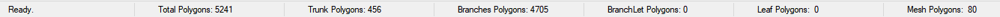

# Recherche 

**Objectif**: Créer un outil web interactif permettant aux étudiants de pratiquer la taille d’arbres jeunes/moyens en identifiant 5 à 7 défauts par arbre (sanitaires, structurels, branches basses, angles aigus, etc...)

## Contexte et Contraintes du Projet

- Arbres jeunes/moyens seulement (peu de branches, pas de feuilles requises)
- 5 à 7 défauts clairs par arbre (malades, brisées, interférentes, angles aigus, espacement axiale/radiale mauvais, branches basses temporaires, verticales, etc...)
- Interaction : cliquer sur une branche + feedback (bonne/mauvaise coupe qui montre la branche en vert ou rouge + explication pédagogique optionnel)
- Vue 3D libre (orbite 360°)
- Scénarios/exercices multiples si possible.
- Interface web
- Doit être le moins lourd possible

## Three.js 

- ~500 KB–2 MB taille du bundle
- Excellente facilité d'interaction (clic dans notre cas)

- **Mécaniques à implémenter**:
  - **Scene + Camera + Renderer** (WebGLRenderer ou WebGPURenderer si possible)
  - **Branch hierarchy**: Chaque branche doit être un `Mesh` séparé contenant le type de défaut (sanitary, structure, etc...) si il y'en a
  - **[Raycasting](https://threejs.org/docs/#api/en/core/Raycaster)**: `raycaster.intersectObjects()` sur clic/touch -> détecter exactement quelle branche est touchée
  - **Feedback pédagogique** : couleur (vert/rouge) + panneau HTML ou tooltip avec explication + score si on veut rendre l'experience comme un jeu pour capter l'attention des étudiants
  - **OrbitControls** (ou TrackballControls) pour vue 360°
  - **Données des arbres**: Si on fait plusieurs arbres on peut utiliser une base de donnée JSON (arbre + liste des bonnes et mauvaise coupes)
  - **Performance**: InstancedMesh pour branches identiques, low-poly, pas de feuilles

### Raycasting dans Three.js

- Hover sur les branches + clic pour sélectionner
- Three.js vérifie quels objets (meshes) ce rayon touche dans la scène
- On récupère l’objet le plus proche (la branche touchée)

- Permet le hover: quand la souris passe sur une branche, on peut la surligner (exemple: bordure jaune ou changement de couleur temporaire)
- Permet le clic: quand l’étudiant clique, on identifie exactement quelle branche (ou segment de branche) a été touchée
- Supporte la hiérarchie: une grosse branche peut être composée de plusieurs meshes (tronçon 1, 2, 3). On peut couper un segment à la fois ou toute la branche d’un coup

- Démo officielle de sélection d’objets par Dan Greenheck (auteur d’EZ-Tree) :  
  https://dgreenheck.github.io/threejs-object-selection/  
  https://github.com/dgreenheck/threejs-object-selection (repo) 
- Tutoriel par Dan Greenheck :  
  https://www.youtube.com/watch?v=QATefHrO4kg
- Exemples de tracking avec le hover:  
  https://threejs.org/examples/#webgl_interactive_cubes    
  https://threejs.org/docs/#api/en/core/Raycaster    
  https://threejs.org/examples/#webgl_interactive_lines    

##  Moteurs de Jeu avec Export Web

- **Unity + WebGL**:
  - Plugin: Procedural Tree Builder (Asset Store), [OpenFracture](https://github.com/dgreenheck/OpenFracture)

- **Godot + HTML5 export**:
  - Plugin: [gdTree3D](https://github.com/JekSun97/gdTree3D)

## Outils de Modélisation 3D + Export vers Web

- **Blender**:
  - [Easy Tree](https://extensions.blender.org/add-ons/easy-tree/)
  - Générer arbres procéduraux et exporter en .glb -> charger dans Three.js / EZTree ?
  - [The Grove 3D](https://www.thegrove3d.com/) (Payant)

- **Maya**:
  - Option de générer des arbres par brush (Content browser) mais pas trop bon. Blender serait meilleur
 
## Type de fichiers
Les fichiers  GLB  sont idéals pour les applications web parce qu'il est compacte et il a un temps de chargement rapide tandis que les fichiers .fbx sont idéals pour les animations complexes et le développement de jeux.

Godot recommande d'utiliser surtour les fichiers  GLB. Pour utiliser les fichiers FBX, il faudrait installer un programme externe

Unity recommande d'utiliser surtout les fichiers FBX. Pour être capable de bien utiliser les fichiers  GLB, unity demande d'utiliser une extension.

Three.js recommande surtourt d'utiliser fichiers GLB qui sont idéals pour le web comparé aux autres formats qui pourraitt prendre du temps à charger comme les fichiers FBX

## Performance web
Voici un site web qui compare three.js et unity pour la performance web : [Three.js vs Unity for Web | Comparison Guide 2026](https://www.utsubo.com/blog/threejs-vs-unity-web-comparison?utm_source=chatgpt.com)

Pour Godot, il est principalement utiliser pour des jeux plus complexe. Il se retrouverait entre unity et three.js mais plus proche d'unity. La performance pourrait être légèrement lente.

Voici un site web qui compare three.js et godot: [three.js vs. Godot | Needle](https://cloud.needle.tools/compare/needle-vs-threejs-vs-godot?utm_source=chatgpt.com)

## Système
Génération d'abre:
 - FloraSynth : basé sur du L-system
 - EZ-Tree

Comparaison
- L-system:
  -  méthode mathématique basée sur des règles pour générer des structures comme des arbres
  -  très précis et complexe
  -  faut rajouter l'aléatoire
  -  simulation croissance
  -  besoin d'être codé
[L-System : définition et explications](https://www.techno-science.net/definition/11374.html)

- EZ-Tree
  - librairire
  - plus ou moins complexe
  - aléatoire déjà intégrer
  - génération rapide
  - prêt à l'emploi     
[GitHub - dgreenheck/ez-tree: Procedural tree generator written with JavaScript and Three.js · GitHub](https://github.com/dgreenheck/ez-tree)

Dans ce cas, le plus simple serait d'utiliser la libraire de EZ-Tree et de la modifier.

## Exemple de site web qui utilise Three.js pour la 3D

- **[EZ-Tree](https://github.com/dgreenheck/ez-tree) /  [Démo](https://www.eztree.dev/)** 
  - C'est un générateur potentiel que nous pouvons utiliser    
  - On peut ajouter raycasting + tagging de défauts par-dessus
  - ["Creating realistic 3D trees with Three.js"](https://tympanus.net/codrops/2025/01/27/fractals-to-forests-creating-realistic-3d-trees-with-three-js/)
  - Plusieurs paramètres (niveaux de branches, angles axiaux/radiaux, espacement, gnarliness, etc...)

- **[Three.js Raycasting Object Selection](https://dgreenheck.github.io/threejs-object-selection/)** (par l’auteur d’EZ-Tree)  
  - Hover + clic sur objets hiérarchiques (branches)  
  - Exactement la mécanique hover -> sélection -> feedback couleur que nous voulons

- **[Interactive cutting of pieces off a mesh (three-bvh-csg)](https://discourse.threejs.org/t/demo-interactive-cutting-of-pieces-off-a-mesh-three-bvh-csg-rapier3d/45404)**    
  - Démo Three.js: tu “coupes” un mesh en temps réel avec une brosse, le mesh se met à jour  
  - Preuve que le “clic pour couper/supprimer une partie” fonctionne en WebGL sans animation lourde

- **[FloraSynth – Procedural Tree Generator](https://www.florasynth.com/)**  
  - Appuie sur espace pour générer des arbres différents, vue 3D libre
  - Preuve que la génération + interaction 3D d’arbres jeunes fonctionne parfaitement dans un navigateur

- **[AJM Tree Generator](https://andrewmarsh.com/software/tree3d-web/)**  
  - Web app qui génère des arbres procéduraux 3D en direct (abstraits ou réalistes), vue 360°    

- **[3D2cut – Digital Vine Pruning Training](https://www.3d2cut.com/)**  
  - Plateforme web avec simulations interactives de coupe sur vignes 3D

- **[Go Bonsai – Interactive 3D Tree Simulator](https://frankforce.com/games/go-bonsai/)**  
  - Version application
 
## Texture des arbres des exemples

### Réaliste   
Florasynth:     
        
The Grove:    
  

### Semi-réaliste
Go bonsai:    
       
EZ-Tree:      
     

### Low-poly
AJM:  

## Solution principale retenue à date: Three.js + EZ-Tree + Raycasting

- Parfaitement adapté au web
- EZ-Tree donne le contrôle procédural dont on a besoin (jeunes arbres, 5-7 défauts faciles à taguer).
- Interaction clic/coupe avec "raycasting"
- Support WebGPU
- Bundle léger et optimisation facile

**Options rejetées**:
- Unity WebGL: trop lourd comparé à Three.js
- Maya/Blender: pas interactif en temps réel sans l'utilisation de Three.js derrière

## Ressources d'arbres 3D (pas généré)

- Sites de modèles gratuits:
  - [Free3D](https://free3d.com/3d-models/lowpoly-tree)
  - [Sketchfab](https://sketchfab.com/3d-models/low-poly-tree-for-webgl-521bf4886fa849bdb474020fc9c7bc4c)
  - [Poly Pizza](https://poly.pizza/search/tree)
  - [CGTrader](https://www.cgtrader.com/low-poly-3d-models/tree)

## "Tree It"

C’est un générateur de modèles d’arbres 3D: tu construis l’arbre en ajoutant et en modifiant des joints et tu peux les éditer individuellement pour casser les branches pour créer des défauts 

**Lien**:  
- [Steam](https://store.steampowered.com/app/2386460/Tree_It/)  
- [Site officiel (version gratuite)](http://www.evolved-software.com/treeit/treeit)

**Points utiles pour notre projet**:  
- Création rapide d’arbres jeunes/moyens  
- Énornement d'option de personnalisation  
- Export dans plusieurs formats : .obj, .fbxm etc...  

**Comment l’utiliser avec notre outil web**:  
1. Créer l’arbre dans Tree It  
2. Casser ou ajuster les branches pour avoir les défauts voulus  
3. Exporter en .obj ou .fbx  
4. Convertir en .glb avec Blender  
5. Charger le .glb dans Three.js  
6. Ajouter le raycasting pour le hover et le clic (comme expliqué plus haut)

**Avantages**:  
- On peut contrôlesr chaque branche
- Mesh bien fait de base  

## Divisions des mesh
Bon exemple de séparation de mesh et de hiérarchie parent-enfant, on le retrouve dans The Grove lorsqu'on active le mode skeleton : [The Grove 3D](https://www.thegrove3d.com/)         
Un arbre ne peut pas être un seule mesh. Il a besoin d'un hiérarachie pour le tronc, branches et sous-branches

### Code
- faudras faire les différents mesh dans le code
- Dans le code, faut faire l'hiérarchie de parents-enfants
- les segments contrôle leur enfants
- Compatible avec le L-system
- Si on fait un simple cylindre, la fin de la branche ne sera pas fermé. Faut rajouter openEnded = true. [CylinderGeometry – three.js docs](https://threejs.org/docs/?q=cyli#CylinderGeometry)

### Modélisation
- Chaque partie = mesh séparé
- faut modéliser la fin de chaque branche ou les branches qu'on veut séparée
- Découpé et faire l'hiérarchie de parent-enfant avant l'importation
- Besoin de plusieurs mesh pour chaque arbre
- Il est possible de faire la hiérarchie sur Blender et la gérer dans Three.js par la suite.        
Pour couper des mesh sur blender: [How to Separate Meshes in Blender - YouTube](https://www.youtube.com/shorts/ctBjLaRyjVA)           
Pour connecter un enfant à un parent: [How to parent objects - Blender 4.3 - YouTube](https://www.youtube.com/watch?v=x7KJbEhB4qI)
- The Grove utiliser blender pour faire le coupage de branches.[Technical overview - The Grove](https://www.thegrove3d.com/learn/technical-overview/)

