# Processus de travail

Ce document décrit le processus complet de création et d'export des arbres, de TreeIt jusqu'à leur intégration dans le projet.

---

## 1. Création dans TreeIt

- Créer l'arbre selon les spécifications
- Valider avec le client et ajuster si nécessaire
- Exporter en fbx: `treeX_TreeIt.fbx` (ex: `Tree6_TreeIt.fbx`)

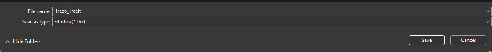

- Garder le fichier TreeIt (.tre) dans le dossier `trees` du GitHub
- Tous les textures de TreeIt sont déjà dans le dossier `trees/texture` du GitHub
- Assurer de mettre le fichier .tre sur le OneDrive (`arbres TreeIt`)

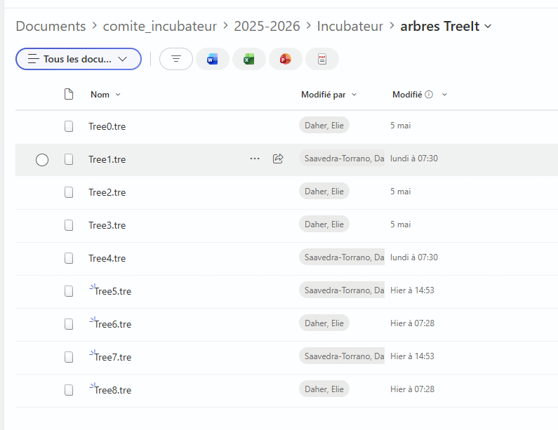

---

## 2. Travail dans Maya (optionnel)

Cette étape peut être ignorée et tout se faire directement dans Blender.

- Aller dans File > Set Project et Project Window pour respecter l'espace de travail par défaut

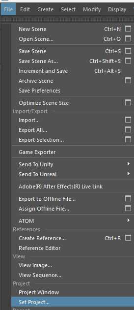
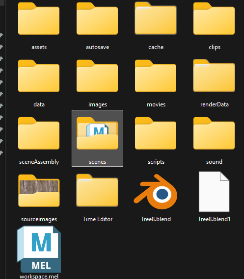

- Mettre le fbx (`treeX_TreeIt.fbx`) dans le dossier `scenes`
- Placer les textures de TreeIt dans `sourceimages`
- Organiser la hiérarchie:
  - Grouper les meshes avec Ctrl+G > `TreeX` (ex: `Tree8`)
  - Dedans: `bottom_trunk` et `top_trunk`
  - Distribuer les meshes dans les bons groupes
- Bref, assurer de suivre cette hiérarchie       
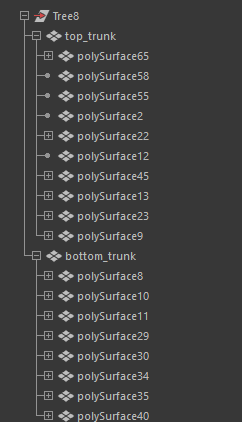
- Exporter en fbx: `TreeX_Maya.fbx` (ex: `Tree8_Maya.fbx`)


---

## 3. Travail dans Blender

- Importer le fbx (`TreeX_TreeIt.fbx` ou `TreeX_Maya.fbx`)
- Si cela n'est pas fait, faite les séparations et l'hiérarchie dans Blender
- Aller sur l'onglet Shading > Ajouter les 3 textures: base color, normal, roughness
  - Optionnel: Renommer le node de la texture avec le nom de l'arbre (ex: `Tree8`)

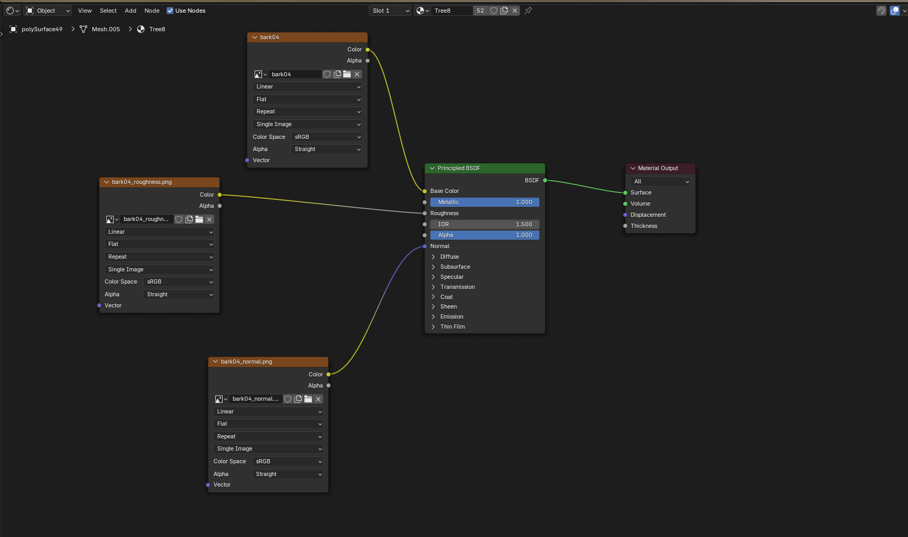

- Object > Custom Properties > Ajouter les tags:
  - Branche défectueuse: `isBad` (true) + son type (ex: `débordante`)
  - `bottom_trunk`: ajouter `indestructible` (empêche de couper le tronc principal)

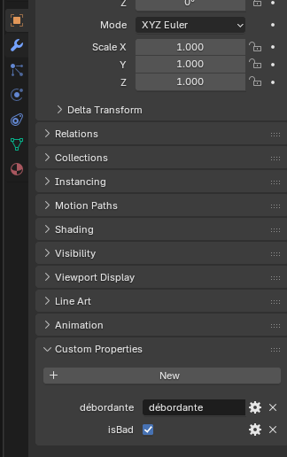

- File > Export > glTF 2.0 (.glb):
  - Include: cocher Custom Properties
  - Remember Export Settings (pour ne pas le refaire)
  - Nommer: `TreeX.glb` (ex: `Tree8.glb`)

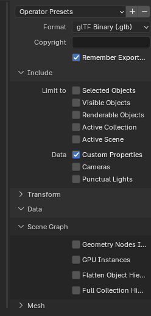

---

## 4. Intégration dans le projet

- Mettre le `.glb` dans `docs/models`
- Ouvrir `docs/main.js` lignes 50-51
- Ajouter une nouvelle entrée dans `const TREES`:
  - `id`: numéro unique
  - `label`: nom affiché
  - `model`: chemin du glb (ex: `./models/Tree8.glb`)
  - `scale`: ajuster le scale au besoin si il est trop grand/petit 

**Exemple:**
```
{ id: 8, label: "Arbre 8", model: "./models/Tree8.glb", scale: 0.7 }
```

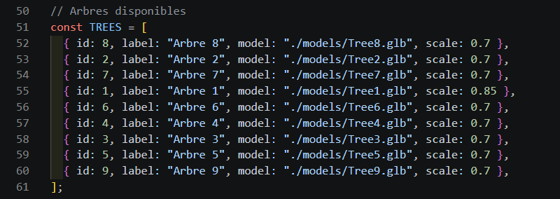

- Assurer de mettre le fichier/dossier Blender/Maya dans le OneDrive  (`incubateur 2026 > Incubateur > Maya et Blender`)

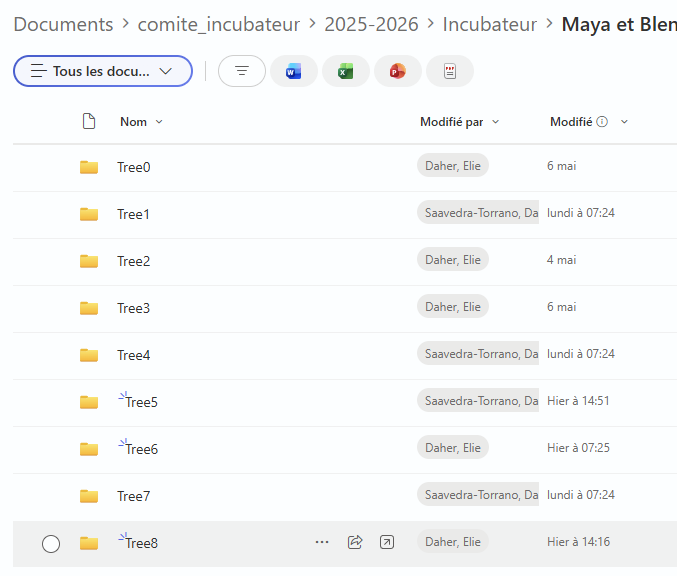

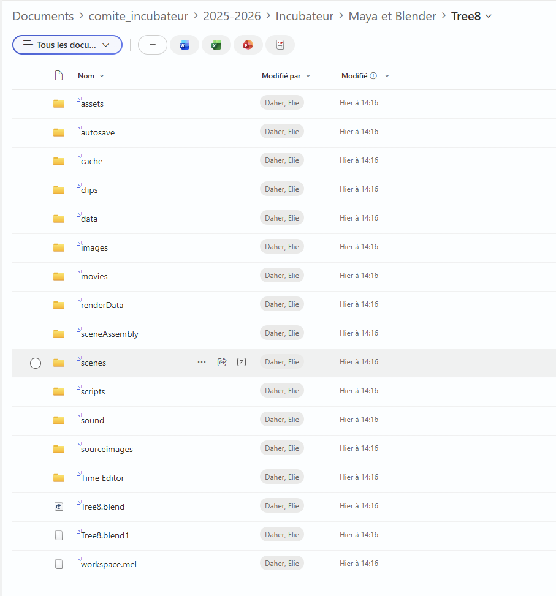

