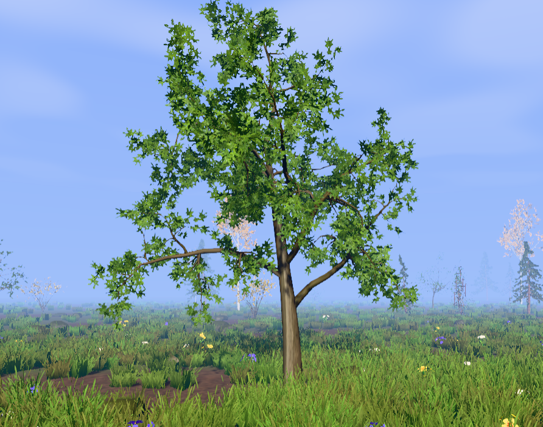
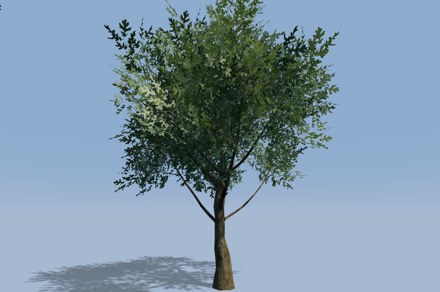
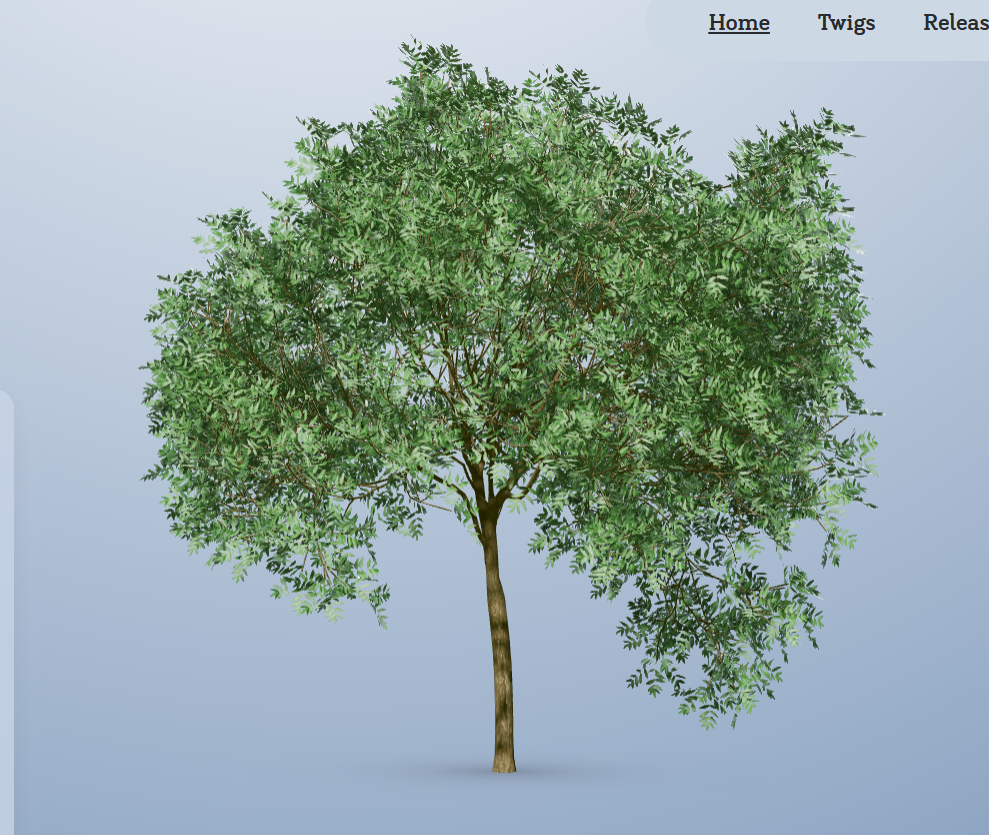
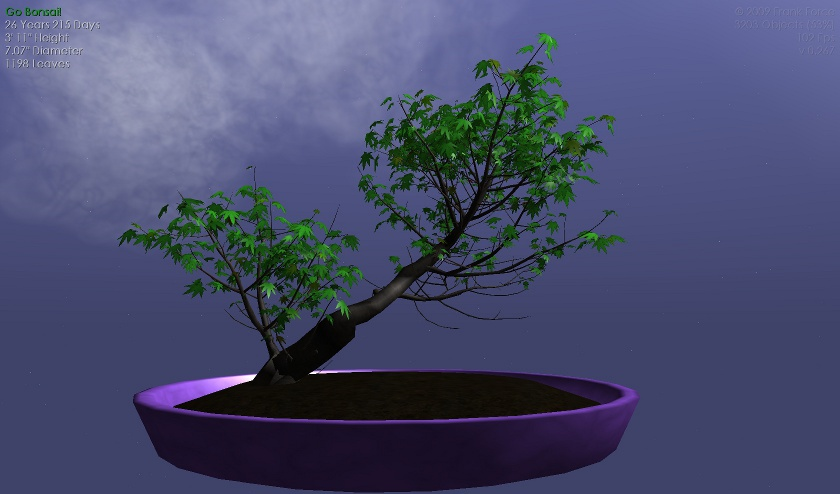
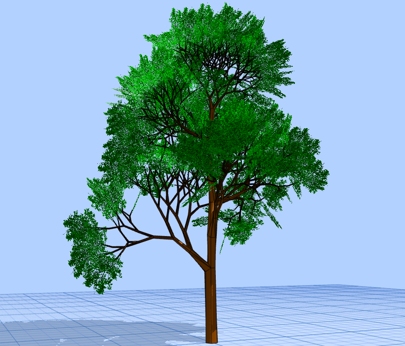

# Recherche Dana

## Type de fichiers
Les fichiers  GLB  sont idéals pour les applications web parce qu'il est compacte et il a un temps de chargement rapide tandis que les fichiers .fbx sont idéals pour les animations complexes et le développement de jeux.

Godot recommande d'utiliser surtour les fichiers  GLB. Pour utiliser les fichiers FBX, il faudrait installer un programme externe

Unity recommande d'utiliser surtout les fichiers FBX. Pour être capable de bien utiliser les fichiers  GLB, unity demande d'utiliser une extension.

Three.js recommande surtourt d'utiliser fichiers GLB qui sont idéals pour le web comparé aux autres formats qui pourraitt prendre du temps à charger comme les fichiers FBX

## Performance web
Voici un site web qui compare three.js et unity pour la performance web : [Three.js vs Unity for Web | Comparison Guide 2026](https://www.utsubo.com/blog/threejs-vs-unity-web-comparison?utm_source=chatgpt.com)

Pour Godot, il est principalement utiliser pour des jeux plus complexe. Il se retrouverait entre unity et three.js mais plus proche d'unity. La performance pourrait être légèrement lente.

Voici un site web qui compare three.js et godot: [three.js vs. Godot | Needle](https://cloud.needle.tools/compare/needle-vs-threejs-vs-godot?utm_source=chatgpt.com)

## Système
Génération d'abre:
 - FloraSynth : basé sur du L-system
 - EZ-Tree

Comparaison
- L-system:
  -  méthode mathématique basée sur des règles pour générer des structures comme des arbres
  -  très précis et complexe
  -  faut rajouter l'aléatoire
  -  simulation croissance
  -  besoin d'être codé
[L-System : définition et explications](https://www.techno-science.net/definition/11374.html)

- EZ-Tree
  - librairire
  - plus ou moins complexe
  - aléatoire déjà intégrer
  - génération rapide
  - prêt à l'emploi     
[GitHub - dgreenheck/ez-tree: Procedural tree generator written with JavaScript and Three.js · GitHub](https://github.com/dgreenheck/ez-tree)

Dans ce cas, le plus simple serait d'utiliser la libraire de EZ-Tree et de la modifier.

## Texture des arbres des exemples

### Réaliste
EZ-Tree:      
        
Florasynth:     
        
The Grove:    
  

### Semi-réaliste
Go bonsai:    

### Low-poly
AJM:  

## Divisions des mesh
Bon exemple de séparation de mesh et de hiérarchie parent-enfant, on le retrouve dans The Grove lorsqu'on active le mode skeleton : [The Grove 3D](https://www.thegrove3d.com/)
Un arbre ne peut pas être un seule mesh. Il a besoin d'un hiérarachie pour le tronc, branches et sous-branches

### Code
- faudras faire les différents mesh dans le code
- Dans le code, faut faire l'hiérarchie de parents-enfants
- les segments contrôle leur enfants
- Compatible avec le L-system
- Si on fait un simple cylindre, la fin de la branche ne sera pas fermé. Faut rajouter openEnded = true. [CylinderGeometry – three.js docs](https://threejs.org/docs/?q=cyli#CylinderGeometry)

### Modélisation
- Chaque partie = mesh séparé
- faut modéliser la fin de chaque branche ou les branches qu'on veut séparée
- Découpé et faire l'hiérarchie de parent-enfant avant l'importation
- Besoin de plusieurs mesh pour chaque arbre        
Pour couper des mesh sur blender: [How to Separate Meshes in Blender - YouTube](https://www.youtube.com/shorts/ctBjLaRyjVA)           
Pour connecter un enfant à un parent: [How to parent objects - Blender 4.3 - YouTube](https://www.youtube.com/watch?v=x7KJbEhB4qI)
- The Grove utiliser blender pour faire le coupage de branches.[Technical overview - The Grove](https://www.thegrove3d.com/learn/technical-overview/)

  

